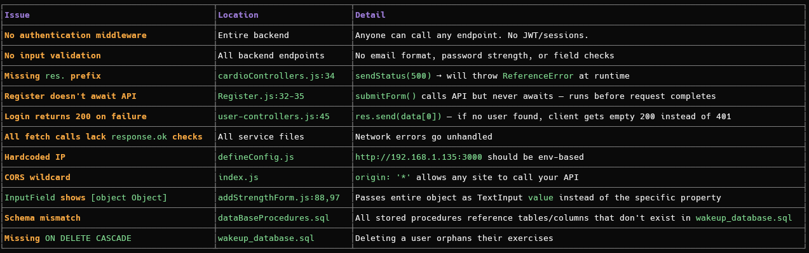
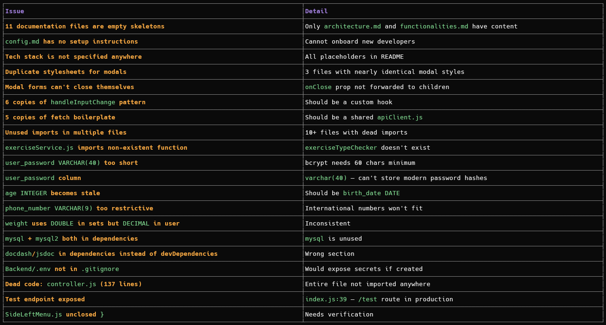
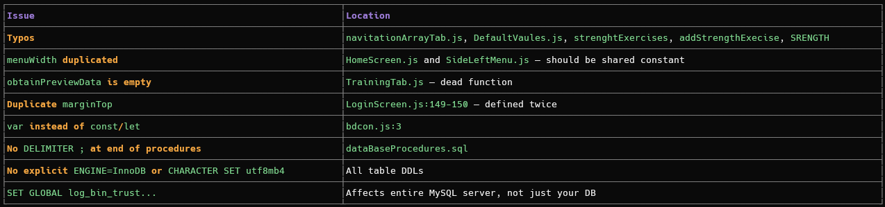

Okey. I need you eamine the code on this repository and check if any can be improved.
Thinking: The user wants me to examine the code in this repository and check if anything can be improved. I'm in plan/read-only mode, so I can only read and analyze. Let me explore the codebase thoroughly to find potential improvements.

Let me start by exploring the structure of both frontend and backend directories.
I'll explore the codebase thoroughly to find potential improvements. Let me start by examining both the frontend and backend.
│ Explore Task — Explore frontend codebase
└ 42 toolcalls · 2m 54s
│ Explore Task — Explore backend codebase
└ 42 toolcalls · 2m 39s
│ Explore Task — Explore database folder
└ 8 toolcalls · 2m 0s
│ Explore Task — Explore documentation
└ 22 toolcalls · 1m 10s
ctrl+x down view subagents

Thinking: Now I have a comprehensive view of the entire codebase. Let me organize this into a clear, structured plan of improvements for the user. Let me summarize the most critical findings.
Here's a comprehensive analysis of the entire repository with prioritized improvements:
---
🔴 CRITICAL Issues (Fix Immediately)
1. **Authentication guard is broken** — all screens visible to everyone
``frontend/src/navigation/AppNavigator.js:27-51``
(typeof user !== "null") || (typeof user !== "undefined")
This always evaluates to true. typeof returns a string like "object", never "null". Users see Home/Exercises/Feeding screens without logging in.
2. **Hardcoded database password in source code**
``Backend/bdcon/bdcon.js:3-10``
password: "abc123."
A root MySQL password committed to the repo. Anyone with access can connect to your database.
3. **SQL injection vulnerabilities (legacy code)**
`Backend/controllers/controller.js` — 7 functions concatenate user input into SQL without parameterization. Even though this file isn't currently wired to routes, it exists and could be accidentally connected.
4. **Passwords stored and compared in plain text**
``Backend/controllers/user-controllers.js:33-38`` — No hashing. Raw password goes directly into SQL.
5. **Try-catch dead code pattern (3 files)**
``LoginScreen.js, addStrengthForm.js, addCardioForm.js``
```js
catch (error) {
    throw new Error("Something is wrong");
    console.error(error);  // NEVER EXECUTES
}
```

The console.error is unreachable. The unhandled throw causes unhandled promise rejections.

---
🟠 HIGH Priority
> 

---
🟡 MEDIUM Priority
> 

---
🟢 LOW Priority (Code Quality)
> 

---
📋 Recommended Plan of Action
1. Security first — rotate DB password, move credentials to .env, add Backend/.env to .gitignore
2. Fix auth bypass — correct the typeof check in AppNavigator.js
3. Fix dead catch blocks — remove throw, keep console.error, handle errors properly
4. Add response.ok checks to all fetch calls
5. Delete dead code — controller.js, dataBaseProcedures.sql (rewrite), unused imports
6. Add input validation — express-validator or joi on backend
7. Setup documentation — fill config.md and stack.md
8. Refactor fetch boilerplate into a shared apiClient.js
9. Extract form state handler into a custom hook
10. Extract shared modal styles and fix InputField value binding