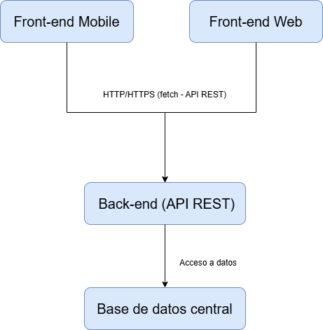

## 3. Arquitectura del sistema

### 3.1 Visión general

El sistema se plantea como una aplicación multiplataforma, accesible tanto desde una aplicación móvil como desde una aplicación web. El desarrollo se centra principalmente en la experiencia móvil, utilizando tecnologías orientadas a este entorno, aunque manteniendo la compatibilidad con el acceso desde navegadores web.

La arquitectura del sistema sigue un modelo cliente–servidor, en el que se distinguen claramente las responsabilidades del frontend y del backend. El frontend será el encargado de la interacción con el usuario y de la presentación de la información, mientras que el backend gestionará la lógica de negocio y el acceso a los datos.

El acceso al sistema se realizará a través de la aplicación móvil o la versión web, que actuarán como clientes y se comunicarán con el backend mediante peticiones a una interfaz de programación de aplicaciones (API). Aunque actualmente no existe un servidor central definido, el diseño del sistema contempla esta separación lógica para facilitar su futura evolución.

La elección de esta arquitectura se basa en la simplicidad y claridad de diseño, permitiendo un desarrollo progresivo del proyecto, así como una mejor mantenibilidad y escalabilidad a largo plazo.

---

### 3.2 Diagrama de arquitectura

El diagrama de arquitectura representa de manera visual los componentes principales del sistema y la comunicación entre ellos, mostrando la separación de responsabilidades y el flujo de información.

#### Componentes principales
El sistema está compuesto por cuatro bloques principales:

1. **Frontend Web**: Aplicación accesible desde navegadores, encargada de la interacción con el usuario y la presentación de la información.
2. **Frontend Móvil**: Aplicación desarrollada principalmente para dispositivos móviles, que comparte la lógica conceptual con el frontend web.
3. **Backend (API REST)**: Responsable de la lógica de negocio, la validación de datos y la gestión de peticiones provenientes de los clientes.
4. **Base de datos central**: Almacena la información relacionada con los usuarios, los entrenamientos (fuerza y cardio), la dieta y el progreso del usuario.

#### Flujo de comunicación

- El **Frontend Web** y el **Frontend Móvil** actúan como clientes y se comunican directamente con el backend mediante peticiones HTTP/HTTPS a la API REST.
- El **Backend** es el único componente que accede a la base de datos central, realizando operaciones de lectura y escritura según las solicitudes de los clientes.

### Representación del diagrama

### 3.3 Separación Frontend / Backend / Base de Datos

En esta sección se describen las responsabilidades de cada capa del
sistema y la forma en que se comunican entre sí, siguiendo el modelo cliente–servidor definido en la arquitectura.

#### **Frontend**

El frontend es la capa encargada de la interacción con el usuario y la presentación de la información. Sus responsabilidades principales incluyen:

- Mostrar los datos de los entrenamientos en el día seleccionado.
- Mostrar los datos de la dieta en el día seleccionado.
- Recibir la información introducida por el usuario y enviarla al backend para su procesamiento o almacenamiento.

La comunicación con el backend se realiza mediante **peticiones HTTP/HTTPS**, utilizando la función `fetch` para interactuar con los endpoints de la API REST.

Actualmente, el frontend no realiza validaciones de los datos antes de enviarlos, aunque en futuras versiones se implementaran validaciones básicas de formato o campos obligatorios para mejorar la experiencia de usuario y evitar errores en la base de datos.

---

### Backend

El backend es la capa encargada de la lógica de negocio y de la gestión de datos. Sus responsabilidades incluyen:

- Procesar las solicitudes recibidas desde el frontend.
- Enviar al frontend los datos solicitados, como entrenamientos, dietas o progreso.
- Recibir los datos introducidos por el usuario y almacenarlos o actualizarlos en la base de datos.
- Exponer una serie de **endpoints REST** para que los clientes puedan interactuar con el sistema.

El backend es también el responsable de la validación de los datos y de la seguridad de la información. Aunque actualmente no se han definido reglas concretas de validación, se implementaran controles como:

- Verificación de formatos (números, fechas, textos obligatorios).
- Validación de rangos (por ejemplo, peso o repeticiones válidas en entrenamientos).
- Control de acceso mediante autenticación de usuarios.

---

### Base de datos

La base de datos es centralizada y almacena toda la información del sistema. Entre los datos que gestiona se incluyen:

- Información de los usuarios.
- Entrenamientos (fuerza y cardio).
- Dietas y registro de macronutrientes.
- Progreso y estadísticas del usuario.

El acceso a la base de datos se realiza únicamente a través del backend, garantizando la seguridad de la información y evitando accesos directos desde el frontend.

---

### Ventajas de la separación de responsabilidades

Mantener una separación clara entre frontend, backend y base de datos aporta varias ventajas:

- **Seguridad:** El frontend nunca accede directamente a la base de datos, evitando exposiciones innecesarias.
- **Mantenibilidad:** Cada capa puede desarrollarse, modificarse o escalarse de forma independiente.
- **Escalabilidad:** Permite futuras mejoras, como separar el backend en microservicios o añadir nuevas plataformas cliente sin afectar la base de datos.
- **Claridad en el diseño:** Cada componente tiene un rol definido, lo que facilita la comprensión y la evolución del sistema.

### 3.4 Flujo de datos

#### Acciones principales del usuario
Los usuarios pueden realizar diversas acciones en la aplicación:

- Registrar usuario
- Iniciar sesión
- Registrar, editar o borrar entrenamientos
- Registrar, editar o borrar dietas
- Ver entrenamientos y dietas
- Consultar estadísticas
- Editar información personal